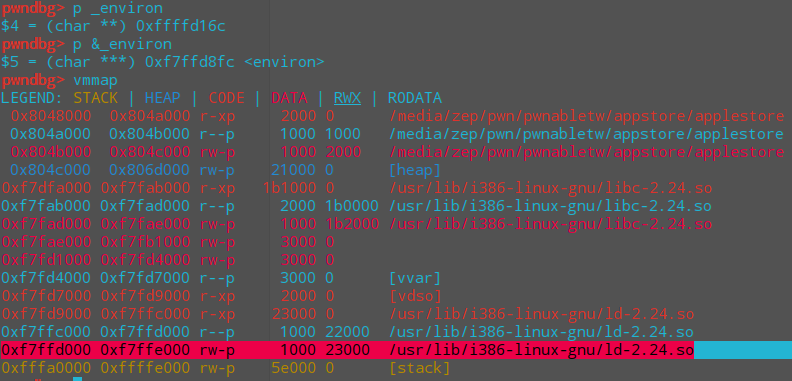
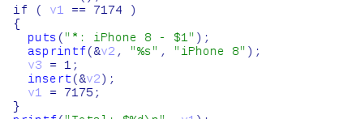
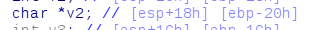
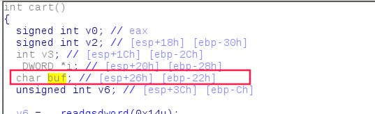
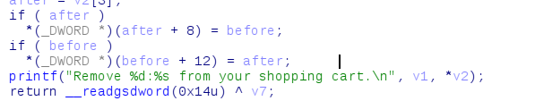
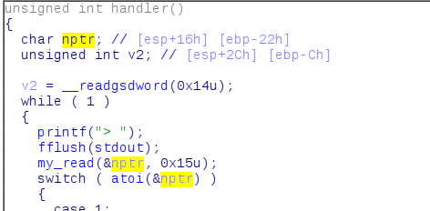
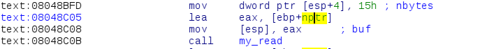

# applestore

## environ



可以获取栈地址。


## 漏洞

这个题的漏洞很有意思，不是直接的溢出，先解释一下流程。程序用了这样的一个结构体

```c
struct commodity{
    char * name;
    int * price;
    commodity* before;
    commodity* next;
}
```

`add`就是平平无奇的添加，除了数字的选择没有别的输入，`delete`就是脱链，只检查`before`&`after`是否为0。

`cart`是打印`name`和`price`。

`checkout`是漏洞的地方：



这里`insert`的是一个该函数栈上的结构体




因为`checkout`这个函数和其他`switch case`的函数中`ebp`是一样的，和其他函数中的`buf`位置差不多，都可以用`my_read`来改，改完就可以用`delete`来利用了。



本来以为是`unlink`的利用方式，但是`system_addr - 0x8`的位置是代码段，是不可写的，所以不行。

上网查了发现有个栈迁移的操作，把`delete`的`ebp`指向地址的内容改成`atoi_got + 0x22`，这样返回后`handler`的`ebp`指向的就是`atoi_got+0x22`。





那么再次调用`handler`里面的`my_read`的时候，`nptr`就是指向`atoi_got`了，就可以把它改成`system`的真实地址了。

