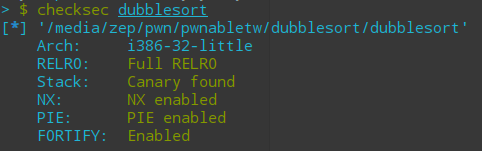
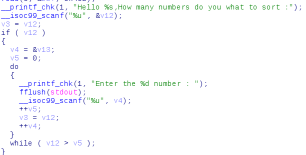
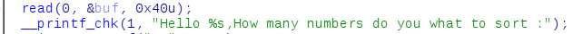
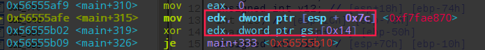
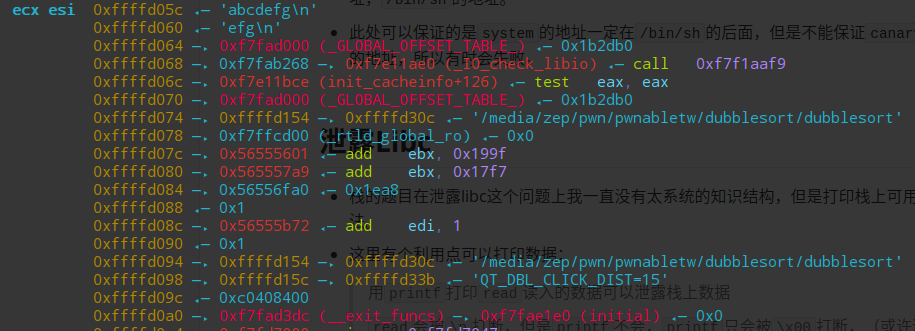

# dubblesort

## 漏洞

- `checksec`发现是32位啥都开了的一个程序

  

  

- `ida`可以看见漏洞是个栈溢出

  

  这里的输入个数是没有限制的。

  题目还给了动态链接库，那么利用方式很明显就是`ret2libc`

  

- 我一开始还想了想格式化字符串这条路，但是`__printf_chk`这个函数禁用`%n`，所以pass掉。

  


## 绕过canary

- 栈溢出的绕过方法，第一个想到的方法应该是打印再重新写入，但是这个题目开了PIE的情况下只有一次输入机会，必须另外找其他的办法。

- 并且还需要注意的是，在输入完成之后会进行**重新排序**

- 根据网络上`o0Ops`博主的`exp`，`scanf("%u",&v)`这个函数在读入的时候，如果读入的是`+`or`-`，不会改变原有地址的数据。

- 那么就可以在`canary`对应的位置输入`+`，而在他之前都输入`0`,之后都输入`0xffffffff`来保证成功绕过。

  

### 后续补充

- 程序是你输入多少个数据，就让这些数据进行排序，所以不只需要保证`canary`的位置正确，还应该保证`system`和`/bin/sh`这两个位置正确。那么之后不应该输入`0xffffffff`，而应该重复输入`system`的地址，`/bin/sh`的地址。
- 此处可以保证的是`system`的地址一定在`/bin/sh`的后面，但是不能保证`canary`的值是否能够小于`system`的地址，所以有时会失败。


## 泄露Libc

- 栈的题目在泄露libc这个问题上我一直没有太系统的知识结构，但是打印栈上可用数据是一种简单有效的做法。

- 这里有个利用点可以打印数据：

  > 用`printf`打印`read`读入的数据可以泄露栈上数据
  >
  > `read`会被`\n`打断，但是`printf`不会，`printf`只会被`\x00`打断，（或许还有别的），那么如果读入数据中没有`\x00`，`printf`就会一直打印直到有`\x00`出现。也就是打印非预期数据。

- 看看栈上面的数据

  

  `esi`所在的位置就是字符串读入的地址。可以看到挺多和`libc`有关的地址的。这个`0xf7`开头的`_GLOBAL_OFFSET_TABLE_`应该是`libc`的`.got.plt`段的首地址，它在`libc`中的偏移可以用

  ```
  get_section_by_name('.got.plt').header.sh_addr
  ```

  获取。

- 只要让字符串读入`\n`覆盖掉`0xf7fad000`的最后一个字节，就可以用`printf`打印出来了。

- 剩下的就是很常见的算`system`和`/bin/sh`的地址了


### 存在的问题

- 栈上面的这些数据的位置是和机器有关的，我本地的`_GLOBAL_OFFSET_TABLE_`的偏移可能是`2`，远程的可能就是`3`，这个不是很确定的一个，没有找到相关的说法。

- 64位机器没有办法`LD_PRELOAD`32位的`libc`，所以`env={'LD_PRELOAD':'./libc32.so.6'}`会一直出现`EOFError`。

  


## 总结

### 知识点

- `read`和`printf`可打印栈数据
- 通过栈数据计算基址
- `scanf('%u',&v)`只输入`+`or`-`时不改变v原来的内容
- `get_section_by_name`