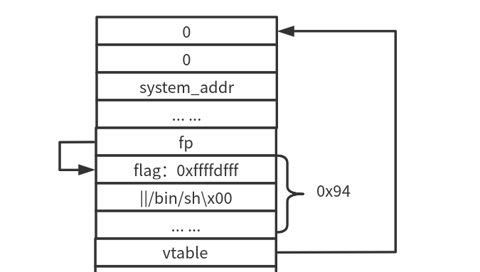

# seethefile

`FILE`结构体的相关操作。

## 相关数据结构

常用的`FILE`实际上是`_IO_FILE_PLUS`结构体

```c
struct _IO_FILE_plus
{
  _IO_FILE file;
  const struct _IO_jump_t *vtable;
};
```

`_IO_FILE`是数据，`vtable`是一个函数虚表。当对文件进行一些IO操作的时候，就会用到`vtable`里面所包含的函数指针。


```c
/*_IO_jump_t虚表结构体*/
/* in libio/libioP.h */
struct _IO_jump_t
{
    JUMP_FIELD(size_t, __dummy);
    JUMP_FIELD(size_t, __dummy2);
    JUMP_FIELD(_IO_finish_t, __finish);
    JUMP_FIELD(_IO_overflow_t, __overflow);
    JUMP_FIELD(_IO_underflow_t, __underflow);
    JUMP_FIELD(_IO_underflow_t, __uflow);
    JUMP_FIELD(_IO_pbackfail_t, __pbackfail);
    /* showmany */
    JUMP_FIELD(_IO_xsputn_t, __xsputn);
    JUMP_FIELD(_IO_xsgetn_t, __xsgetn);
    JUMP_FIELD(_IO_seekoff_t, __seekoff);
    JUMP_FIELD(_IO_seekpos_t, __seekpos);
    JUMP_FIELD(_IO_setbuf_t, __setbuf);
    JUMP_FIELD(_IO_sync_t, __sync);
    JUMP_FIELD(_IO_doallocate_t, __doallocate);
    JUMP_FIELD(_IO_read_t, __read);
    JUMP_FIELD(_IO_write_t, __write);
    JUMP_FIELD(_IO_seek_t, __seek);
    JUMP_FIELD(_IO_close_t, __close);
    JUMP_FIELD(_IO_stat_t, __stat);
    JUMP_FIELD(_IO_showmanyc_t, __showmanyc);
    JUMP_FIELD(_IO_imbue_t, __imbue);
#if 0
    get_column;
    set_column;
#endif
};
```

`JUMP_FIELD`: 是一个接受两个参数的宏

```C
#define JUMP_FIELD(TYPE, NAME) TYPE NAME
```

说实话我不知道放在这里有什么用，应该是和虚函数的重定义有关，但是又没有找到他的初始化步骤，一时半会也没法弄清。所以暂时把这个理解成为指向第二个参数的函数指针。

在`libc2.23`以前，`vtable`的指针是可以更改的。但是后面加入了`vtable check`这种机制，`vtable`的值被限定在几个范围内，例如`glibc`的数组记录的值等，没有详细了解。

跟着源码找了一个`_IO_FINISH`的例子，如果调用了`_IO_FINISH`，从实际上就是调用了`__finish`这个函数，`IO_JUMPS_FUNC(THIS)->FUNC`这行代码应该就是在`vtable`中调用了第三个函数地址了，这是我猜的，上面三个宏我没看懂嘛意思。

```c
#define _IO_MEMBER_TYPE(TYPE, MEMBER) __typeof__ (((TYPE){}).MEMBER)
...
#define _IO_CAST_FIELD_ACCESS(THIS, TYPE, MEMBER) \
  (*(_IO_MEMBER_TYPE (TYPE, MEMBER) *)(((char *) (THIS)) \
				       + offsetof(TYPE, MEMBER)))
...
#define _IO_JUMPS_FILE_plus(THIS) \
  _IO_CAST_FIELD_ACCESS ((THIS), struct _IO_FILE_plus, vtable)
...
#if _IO_JUMPS_OFFSET
# define _IO_JUMPS_FUNC(THIS) \
 (*(struct _IO_jump_t **) ((void *) &_IO_JUMPS_FILE_plus (THIS) \
			   + (THIS)->_vtable_offset))
...
#define JUMP1(FUNC, THIS, X1) (_IO_JUMPS_FUNC(THIS)->FUNC) (THIS, X1)
...
/* The 'finish' function does any final cleaning up of an _IO_FILE object.
   It does not delete (free) it, but does everything else to finalize it.
   It matches the streambuf::~streambuf virtual destructor.  */
typedef void (*_IO_finish_t) (_IO_FILE *, int); /* finalize */
//这里的typedef的意思是把所有返回值为void,参数为_IO_FILE* 和 int 的函数都重命名为_IO_finish_t
#define _IO_FINISH(FP) JUMP1 (__finish, FP, 0)

```

在这个`FILE`中进行IO操作的时候，基本上都会用到这个vtable中的指针来进行函数调用。

再看一下`_IO_FILE`这个结构体：

```c
/*_IO_FILE*/
/* in libio/libio.h */
struct _IO_FILE {
  int _flags;		/* High-order word is _IO_MAGIC; rest is flags. */
#define _IO_file_flags _flags

  /* The following pointers correspond to the C++ streambuf protocol. */
  /* Note:  Tk uses the _IO_read_ptr and _IO_read_end fields directly. */
  char* _IO_read_ptr;	/* Current read pointer */
  char* _IO_read_end;	/* End of get area. */
  char* _IO_read_base;	/* Start of putback+get area. */
  char* _IO_write_base;	/* Start of put area. */
  char* _IO_write_ptr;	/* Current put pointer. */
  char* _IO_write_end;	/* End of put area. */
  char* _IO_buf_base;	/* Start of reserve area. */
  char* _IO_buf_end;	/* End of reserve area. */
  /* The following fields are used to support backing up and undo. */
  char *_IO_save_base; /* Pointer to start of non-current get area. */
  char *_IO_backup_base;  /* Pointer to first valid character of backup area */
  char *_IO_save_end; /* Pointer to end of non-current get area. */

  struct _IO_marker *_markers;

  struct _IO_FILE *_chain;

  int _fileno;
#if 0
  int _blksize;
#else
  int _flags2;
#endif
  _IO_off_t _old_offset; /* This used to be _offset but it's too small.  */

#define __HAVE_COLUMN /* temporary */
  /* 1+column number of pbase(); 0 is unknown. */
  unsigned short _cur_column;
  signed char _vtable_offset;
  char _shortbuf[1];

  /*  char* _save_gptr;  char* _save_egptr; */

  _IO_lock_t *_lock;
#ifdef _IO_USE_OLD_IO_FILE
};

```

中间这些`_IO_read_end`是和文件流缓冲区有关的，减少系统调用的次数，暂时没有深入了解。

`_flag`是用来标识一些特性的，例如只读之类。

`_chain`他是个列表，把`FILE`都连起来的。

## FILE的IO操作

### fopen

除了`stdout`,`stdin`,`stderr`这三个`FILE`是在`glibc`里面的，其他的`FILE`都被分配在了堆上面。

`fopen`的工作流程

- `malloc`

  分配堆上的空间给`FILE`结构体

- `_IO_new_file_init_internal`

  做一些初始化工作

- `_IO_link_in`

  把这个`FILE`链入`_chain`中，注意是链在表头下一个，表头是`_IO_list_all`。

- `sys_open`

  打开这个文件

### fclose

脱链、释放。

```c
/*libio/iofclose.c*/
int
_IO_new_fclose (_IO_FILE *fp)
{
  int status;

  CHECK_FILE(fp, EOF);

#if SHLIB_COMPAT (libc, GLIBC_2_0, GLIBC_2_1)
  /* We desperately try to help programs which are using streams in a
     strange way and mix old and new functions.  Detect old streams
     here.  */
  if (_IO_vtable_offset (fp) != 0)
    return _IO_old_fclose (fp);
#endif

  /* First unlink the stream.  */
  if (fp->_IO_file_flags & _IO_IS_FILEBUF)
    _IO_un_link ((struct _IO_FILE_plus *) fp);

  _IO_acquire_lock (fp);
  if (fp->_IO_file_flags & _IO_IS_FILEBUF)
    status = _IO_file_close_it (fp);
  else
    status = fp->_flags & _IO_ERR_SEEN ? -1 : 0;
  _IO_release_lock (fp);
  _IO_FINISH (fp);
  if (fp->_mode > 0)
    {
#if _LIBC
      /* This stream has a wide orientation.  This means we have to free
	 the conversion functions.  */
      struct _IO_codecvt *cc = fp->_codecvt;

      __libc_lock_lock (__gconv_lock);
      __gconv_release_step (cc->__cd_in.__cd.__steps);
      __gconv_release_step (cc->__cd_out.__cd.__steps);
      __libc_lock_unlock (__gconv_lock);
#endif
    }
  else
    {
      if (_IO_have_backup (fp))
	_IO_free_backup_area (fp);
    }
  if (fp != _IO_stdin && fp != _IO_stdout && fp != _IO_stderr)
    {
      fp->_IO_file_flags = 0;
      free(fp);
    }

  return status;
}
```

```c
#define _IO_IS_FILEBUF 0x2000
```


- ` _IO_un_link`*
- ` _IO_acquire_lock`
- `_IO_file_close_it `*
-  `_IO_release_lock `
- `_IO_FINISH `
- `free`

`fp->_IO_file_flags & _IO_IS_FILEBUF`为真就会调用`*`的函数，这些函数里面会有一些其他的操作，或许辉直接调用`__close`，所以一般会为了简单起见，会把`_flag`设置成`0`。如果无法绕过的话，

`_IO_FINISH`是在`vtable`里面的，可以利用。


## 如何获取libc地址

`/proc/self/maps`这里面存储了进程对应的内存信息

```
> $ cat /proc/24651/maps                                                                                                                              
08048000-0804a000 r-xp 00000000 08:11 7045                               /media/zep/pwn/pwnabletw/seethefile/seethefile
0804a000-0804b000 r--p 00001000 08:11 7045                               /media/zep/pwn/pwnabletw/seethefile/seethefile
0804b000-0804c000 rw-p 00002000 08:11 7045                               /media/zep/pwn/pwnabletw/seethefile/seethefile
09067000-09088000 rw-p 00000000 00:00 0                                  [heap]
f7df6000-f7fa7000 r-xp 00000000 08:01 2894775                            /usr/lib/i386-linux-gnu/libc-2.24.so
f7fa7000-f7fa9000 r--p 001b0000 08:01 2894775                            /usr/lib/i386-linux-gnu/libc-2.24.so
f7fa9000-f7faa000 rw-p 001b2000 08:01 2894775                            /usr/lib/i386-linux-gnu/libc-2.24.so
f7faa000-f7fad000 rw-p 00000000 00:00 0 
f7fcd000-f7fd0000 rw-p 00000000 00:00 0 
f7fd0000-f7fd3000 r--p 00000000 00:00 0                                  [vvar]
f7fd3000-f7fd5000 r-xp 00000000 00:00 0                                  [vdso]
f7fd5000-f7ff8000 r-xp 00000000 08:01 2894696                            /usr/lib/i386-linux-gnu/ld-2.24.so
f7ff8000-f7ff9000 r--p 00022000 08:01 2894696                            /usr/lib/i386-linux-gnu/ld-2.24.so
f7ff9000-f7ffa000 rw-p 00023000 08:01 2894696                            /usr/lib/i386-linux-gnu/ld-2.24.so
ffbb3000-ffbd4000 rw-p 00000000 00:00 0                                  [stack]

```

这道题中本地只会输出前四行，远程就可以输出第五行前面的一部分，一开始我还不知道为什么，但是后面发现是因为`readfile`的时候只读入确定长度的字符串，远程的路径短，所以输出得多。

本地：

远程：


所以需要多次`read` & `write`。

## 构造fake FILE



这里的`flag`不能为0，应该是和它高位是`_IO_MAGIC`有关。

总之绕过`*`的这些函数，然后直接调用`_IO_FINISH`，也就是调用第3个函数指针。


## 本地运行出错


虽然我的版本是2.23，但是也引入了`vtable check`。